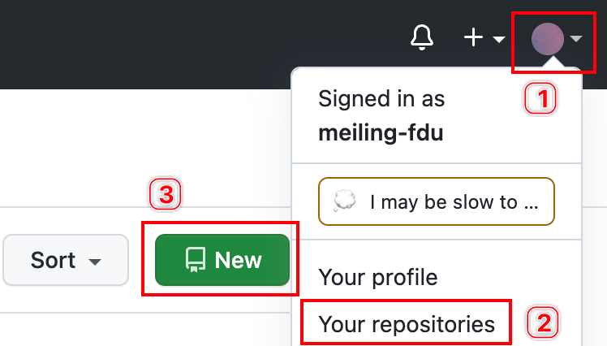
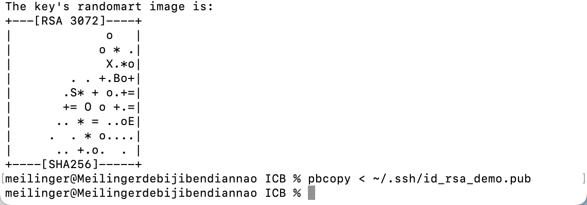
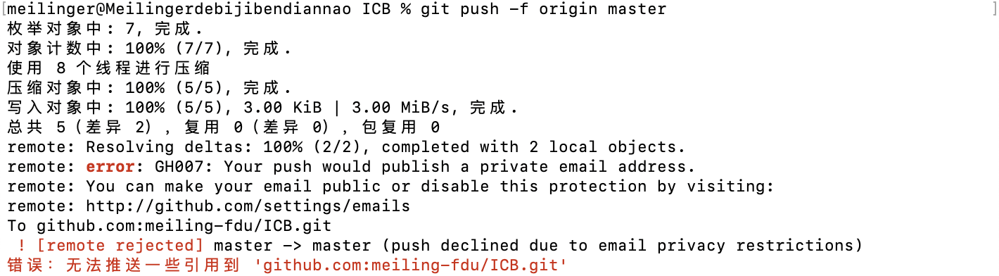

# 详细教程」使用git将本地项目上传至Github仓库（MacOS为例）

```
git config --list 查看已有的配置信息
```

```
Git提交指定文件步骤

1.git status
//查看修改的所有内容（或者git status -s）
2.git add ’ ’，例如:（git add components/pages/holders/xxx.vue）
//’ '引号中间放上文件名，执行上一步后，会显示文件名跟目录

//多个文件用空格分开
3.git stash -u -k
//忽略其他文件,很重要的一步！！！！
4.git cimmit - m ’ ’
//备注提交的内容
5.git pull
6.git push
7.git stash pop
//恢复之前忽略的文件,很重要的一步！！！！

```


### 步骤

- [准备工作：Github端](https://blog.csdn.net/qq_36332660/article/details/131024361#Github_8)
- - [1. 注册 Github 账号](https://blog.csdn.net/qq_36332660/article/details/131024361#1__Github__10)
  - [2. 新建 Github 仓库](https://blog.csdn.net/qq_36332660/article/details/131024361#2__Github__15)
- [准备工作：本地端](https://blog.csdn.net/qq_36332660/article/details/131024361#_28)
- - [1. 安装 Git](https://blog.csdn.net/qq_36332660/article/details/131024361#1__Git_29)
  - [2. 创建本地项目仓库](https://blog.csdn.net/qq_36332660/article/details/131024361#2__61)
- [重磅！本地端&Github端联合操作](https://blog.csdn.net/qq_36332660/article/details/131024361#Github_70)
- - [1. 配置 SSH 与 git config](https://blog.csdn.net/qq_36332660/article/details/131024361#1__SSH__git_config_73)
  - [2. 上传代码](https://blog.csdn.net/qq_36332660/article/details/131024361#2__111)


------

# 准备工作：Github端

## 1. 注册 Github 账号

在 https://github.com/join 注册一个账号，已有账号的同学跳过本步骤。

------

## 2. 新建 Github 仓库

步骤一：登录Github网站，打开网址 https://github.com/，按照如下步骤操作：



步骤二：来到如下界面，填写相应信息，最后点击`Create Repository`完成Github新仓库的创建。


至此，Github端的准备工作就做好啦！接下来我们进入本地操作。

------

# 准备工作：本地端

## 1. 安装 Git

注：已[安装Git](https://so.csdn.net/so/search?q=安装Git&spm=1001.2101.3001.7020)的同学忽略此步骤。

在 https://git-scm.com/downloads 下载Git，Mac系统需要安装[MacOS](https://so.csdn.net/so/search?q=MacOS&spm=1001.2101.3001.7020)版本。


这里我使用第一种方法，即借助`Homebrew`来安装`Git`，所以第一步就是安装`Homebrew`.

**步骤一**：安装 [homebrew](https://so.csdn.net/so/search?q=homebrew&spm=1001.2101.3001.7020)。参考网址： https://brew.sh/

具体操作：打开Mac终端，运行以下命令：

```powershell
/bin/bash -c "$(curl -fsSL https://raw.githubusercontent.com/Homebrew/install/HEAD/install.sh)"
1
```

安装成功界面：

**步骤二**：安装 Git。参考网址：https://git-scm.com/download/mac

具体操作：Mac终端继续运行以下命令：

```powershell
brew install git
1
```

安装后，使用`git --version`命令查看Git版本，输出对应版本说明安装成功，对应界面如下：


------

## 2. 创建本地项目仓库

步骤一：在本地项目所在路径下打开终端，或使用`cd pj_path`命令将终端切换至本地项目所在路径，其中`pj_path`为本地项目所在路径，这里我的本地项目所在的绝对路径是`/Users/meilinger/Desktop/ICB`，`ICB`是我的本地项目名称。

步骤二：使用`git init`命令初始化本地仓库，该步骤执行后，本地项目的根目录下会出现一个名为`.git`的隐藏文件夹。（PS：使用快捷键`Command + Shift + .`三键可以查看隐藏文件）


------

# 重磅！本地端&Github端联合操作

前面的操作中，本地端和Github端均为准备工作，二者无先后之分，下面的才是重头戏～

## 1. 配置 SSH 与 git config

总揽：首先在本地生成`SSH key`（步骤一 ➡️ 步骤三），然后在Github官网将`SSH key`添加至`SSH key`列表中（步骤四）。

**步骤一**：在终端输入`ssh-keygen -t rsa -C email_address`命令，其中`email_address`为注册Github时使用的邮箱。（**注意⚠️：如果Github绑定了多个邮箱，这里填写主邮箱**。）回车，进入下一步骤。

**步骤二**：输入SSH key的生成路径。我这里将`SSH key`的保存路径设置为`/Users/meilinger/.ssh/id_rsa_ICB`，可以看到，为便于记忆，将本地项目名称`ICB`添加至路径结尾～注意：如果直接回车，`SSH key`将会保存至系统提供的默认路径中（这里我的默认生成路径地址为`/Users/meilinger/.ssh/id_rsa`）。如果当前路径下已经存在同名key，可以选择重写与否。回车，输入密码+回车+确认密码+回车。直接回车就是没有密码。

至此，SSH key已经生成啦～


**步骤三**：在终端执行命令`pbcopy < ~/.ssh/id_rsa_demo.pub`将`SSH public key`复制到剪切板，下图所示界面表示操作成功。



**步骤四**：回到Github官网，依次点击**账号头像**、**Settings**、**SSH and GPG keys**以及**New SSH key**，如图。


点击**New SSH key**后系统会自动跳转至以下界面。在本界面，分别填写`Title`和`Key`字段，这里`Title`字段我填充的是本地项目名称，`Key`字段就是我们刚刚在步骤三中使用命令`pbcopy < ~/.ssh/id_rsa_demo.pub`复制的`SSH public key`. 之后点击`Add SSH key`完成添加操作。


接下来回到终端，使用命令`ssh -T git@github.com`验证是否添加成功，若添加成功，会出现如下界面：


> 如果终端返回 `Permission denied (publickey)` 字段，说明上述SSH key没有添加成功。解决方法：在终端执行`命令 ssh-add ~/.ssh/id_rsa_ICB`，记得换成自己的`SSH key`所在路径。

**步骤五**：配置`git config`. 如下图所示，在终端中，依次输入命令：

```
git config --global user.name github_name`
`git config --global user.email github_email
```

其中，`github_name` 为 Github 账号对应的名称，`github_email` 为Github 账号中的主邮箱，即前述步骤中使用的邮箱。


------

## 2. 上传代码

首先：确保此时终端当前所在路径为本地项目所在路径，即`.git`隐藏文件夹的上级目录。

**步骤一**：执行命令`git add .`，将本地项目中的全部文件添加至git中，命令中`.`的含义就是“全部文件”。
**步骤二**：执行命令`git commit -m "description"`，添加项目的描述文字，命令中`description`就是自定义的描述文字。
**步骤三**：执行命令`git remote add origin pj_ssh_path`，其中`pj_ssh_path`可通过下下图的方式进行复制粘贴，比如我这里的`pj_ssh_path`为`git@github.com:meiling-fdu/ICB.git`.


⚠️ PS：此步骤可能会报错“`错误：远程 origin 已经存在。`”，解决办法如图：

先执行命令 `git remote rm origin`删除已存在的远程配置，然后再执行上述命令 `git remote add origin pj_ssh_path`.


**步骤四**：执行命令`git push -f origin master`，将本地项目的文件上传至Github官网中。发现报错如下：



根据[本篇博客](https://blog.csdn.net/qq_26819733/article/details/78374129)的内容，我发现，是Github官网上邮箱设置的相关问题，即我们在[邮箱设置](https://github.com/settings/emails)页面中勾选了`Keep my email addresses private`与`Block command line pushes that expose my email`这两个选项，如下图所示：


所以第一个解决方法就是取消上述两个勾选☑️。但如果我们不想取消上述设置，可通过如下方法解决：

1. 获取Github的推荐邮箱账号。可在[邮箱设置](https://github.com/settings/emails)页面中的如上图所示紫色下划线位置查看。可以看到我的推荐邮箱账号为`73975898+meiling-fdu@users.noreply.github.com`
2. 执行命令`git config --global user.email “推荐E-mail”` 重置全局用户E-mail，这里的`“推荐E-mail”`即为上面的推荐邮箱账号。

在终端执行命令`git config --global user.email`，查看全局邮箱账号是否修改成功，由下图可知，全局邮箱账号已成功修改。


1. 执行命令`git commit --amend --reset-author`重置作者信息。输入命令回车后，进入vi编辑模式，在英文输入法下执行`:wq`保存并退出。（如下图）
   

PS: 若出现如下错误，根据[本篇博客](https://blog.csdn.net/qq_41629756/article/details/100731258)，解决方法为：执行命令`git stash`，如下图所示：


上述错误全部排查完毕后，再次执行命令`git push -f origin master`，就可以成功上传啦！


至此，刷新GitHub页面，就可以看到项目已经上传成功啦！（根据[本篇博客](https://blog.csdn.net/weixin_44554530/article/details/121780735)注意切换至`master`分支哦～）


------

> 后记：之前感觉代码托管很繁琐，一直想学但是因为不是刚需遂束之高阁。今天用起来才发现也没那么难嘛！又掌握了一项技能，果然还是“万事开头难”哇，今日收获：**Just do it !**

-----------------------------

# git常用命令详解


[尹克艰](https://blog.csdn.net/ITerated)已于 2022-11-18 10:43:16 修改903 收藏

分类专栏： [Git](https://blog.csdn.net/iterated/category_10711388.html) 文章标签： [git](https://so.csdn.net/so/search/s.do?q=git&t=all&o=vip&s=&l=&f=&viparticle=)

版权

[Git专栏收录该内容](https://blog.csdn.net/iterated/category_10711388.html)

12 篇文章2 订阅

订阅专栏

### HEAD的含义

> HEAD所指向当前版本
> HEAD^ 上1个版本
> HEAD^^ 上2个版本
> HEAD~1 上1个版本
> HEAD~2 上2个版本

### git查看提交记录

1. 使用git log查看历史版本记录：
   $ `git log --oneline`
2. 查看某文件的历史提交记录
   $ `git log filename`
3. 使用git reflog查看历史版本记录：
   $ `git reflog`
4. 提交到本地版本库：
   $ `git commit -a -m '第n次提交，新增内容：'`

### git打标签

1. 查看本地所有标签：
   $ `git tag 或者 git tag –l`
2. 查看远程所有标签：
   $ `git ls-remote --tags origin`
3. 基于当前所在[commit](https://so.csdn.net/so/search?q=commit&spm=1001.2101.3001.7020)-id创建标签：
   $ `git tag –a <tag_name>`
   $ `git tag -a <tag_name> -m "标签"`
4. 以某一个特定的提交为tag
   $ `git tag –a <tag_name> <commitid>`
5. 把本地某一个标签推送到远程：
   $ `git push origin <tag_name>`
6. 把本地所有标签推送到远程：
   $ `git push origin –tags`
7. 查看本地某个标签的详细信息：
   $ `git show <tag_name>`
8. 切换标签：
   $ `git checkout <tag_name>`
9. 删除本地标签
   $ `git tag -d <tag_name>`
10. 删除远程标签
    $ `git push origin :refs/tags/<tag_name>`
11. 例子：把<tag1_name>标签重命名为<tag2_name>标签
    $ `git tag <tag2_name> <tag1_name>`
    $ `git tag -d <tag1_name>`
    $ `git push origin :<tag1_name>`
    $ `git push --tags`

### git对比差异

1. 比对工作区与暂存区中文件的差异：
   $ `git diff readme.txt`
2. 比对暂存区与本地版本库中文件的差异：
   $ `git diff --cached readme.txt`
3. 比对工作区与本地版本库中文件的差异：
   $ `git diff HEAD readme.txt`
4. 查看两个文件之间的差异：
   $ `git diff <file1> <file2>`
5. 这个对比是在本次修改和某次提交之间进行的：
   $ `git diff <commit id> <file>`
6. 查看两个分支间的区别：
   $ `git diff branch1 branch2`
7. 查看两次提交之间的有差异的文件：
   $ `git diff <commit 1> <commit 2> --stat`

### git查看文件列表

1. 查看暂存区中的文件列表：
   $ `git ls-files`
2. 查看本地版本库中的文件列表：
   $ `git ls-files --with-tree=HEAD`

### git show

1. 查看某一次commit对应的文件修改情况
   $ `git show comitid`
2. 查看某个文件的某个版本的具体内容
   $ `git show commitid:filename`
3. 查看某个某个文件的某次版本提交记录
   $ `git show commitid filename`

### git删除文件

1. `git rm --cached filename`：仅删除暂存区中的指定文件。
2. `git rm filename`：删除工作区和暂存区的文件。
3. 通过`git commit`命令进行提交，可以将本地库中的文件文件也删除。

### git checkout

1. 当执行 `git checkout .` 或者 `git checkout -- <file>`命令时，会用暂存区全部或指定的文件替换工作区的文件，会清除工作区中未添加到暂存区中的改动，即撤销本地工作目录的修改。【缓存区的文件还存在，以缓存区为标准，使工作区和它一致】
   如果文件已添加到暂存区，可使用`git reset HEAD <file>`命令将缓存区同步到指定提交。
2. 当执行 `git checkout HEAD .` 或者 `git checkout HEAD <file>` 命令时，会用 HEAD 指向的
   master 分支中的全部或者部分文件替换暂存区和以及工作区中的文件。 【但是不会清除新增的文件。】
3. git checkout 支持检出指定目录、文件，通过sparse-checkout文件定义要检出目录。

### git merge

将new_branch分支的内容合并到master分支：

1. Fetch and check out the branch for this merge request
   `git fetch origin`
   `git checkout -b new_branch origin/new_branch`
2. Merge the branch and fix any conflicts that come up
   `git checkout master`
   `git merge --no-ff new_branch`
3. Push the result of the merge to GitLab
   `git push origin master`

如果想从其他分支合并某次的commit，可以使用git cherry-pick
用法：`git cherry-pick <commit id>`

### git基础配置

1. 在首次commit时，都会提示要配置username、useremail：
   $ `git config --global user.name “name”`
   $ `git config --global user.email “email”`
2. [添加秘钥](https://blog.csdn.net/ITerated/article/details/112314369)
3. 配置命令别名：
   如用co表示checkout
   $ `git config --global alias.co checkout`
4. 查看已有的配置信息：
   $ `git config --list`

### .gitignore文件

对于不想纳入git管理的文件，可以在仓库根目录下创建一个名为 .gitignore 的文件，列出要忽略的文件模式。下面看一个 .gitignore 文件的例子：

```powershell
# 此为注释 – 将被 Git 忽略
# 忽略所有 .a 结尾的文件
*.a
# 但 lib.a 除外
!lib.a
# 仅仅忽略项目根目录下的 TODO 文件，不包括 subdir/TODO
/TODO
# 忽略 build/ 目录下的所有文件
build/
# 会忽略 doc/notes.txt 但不包括 doc/server/arch.txt
doc/*.txt
# 忽略 doc/ 目录下所有扩展名为 txt 的文件
doc/**/*.txt
#跟踪某类文件
!*.c
#跟踪某个文件夹
!/plutommi/mmi
1234567891011121314151617
```

### 常见问题汇总

1. 提交空目录
   Git仅仅跟踪文件的变动，不跟踪目录
   在要上传的空目录下创建.gitkeep文件
2. 设置忽略文件权限变更
   在git仓库中命令行下执行`git config core.fileMode false`
3. 本地删除或修改文件后如何获取远程的该文件
   $ `git fetch`
   $ `git checkout origin/remotebranch filename`
4. 如何放弃本地修改，用远程库最新内容强制覆盖本地代码
   $` git fetch`
   $ `git reset --hard origin/master`